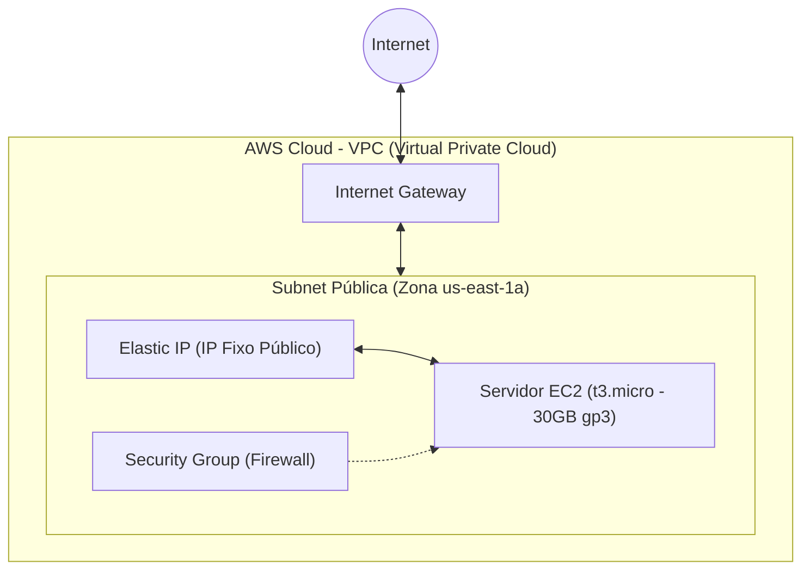

# 🛠️ Documentação da Infraestrutura & Deploy — ZipLink

Este documento descreve toda a infraestrutura na nuvem da AWS projetada para o **ZipLink**, bem como o guia passo a passo para gerenciar, atualizar e destruir os recursos usando o **Terraform**.

---

## 🏗️ Arquitetura da Infraestrutura

A infraestrutura foi desenhada para se enquadrar 100% no **Nível Gratuito da AWS (Free Tier)**, garantindo custo zero e excelente segurança:



### Componentes Criados:
1. **VPC (Virtual Private Cloud)**: Rede lógica isolada (`10.0.0.0/16`).
2. **Subnet Pública**: Sub-rede (`10.0.1.0/24`) com mapeamento de IP público ativado.
3. **Internet Gateway (IGW)**: Permite a entrada e saída de tráfego de internet da VPC.
4. **Security Group (SG)**: Firewall restrito liberando apenas as portas:
   * `80` (HTTP) — Acesso público ao encurtador.
   * `443` (HTTPS) — Tráfego seguro futuro.
   * `22` (SSH) — Acesso administrativo seguro via chaves.
5. **Elastic IP (EIP)**: Endereço IP público fixo e estático associado à máquina.
6. **Instância EC2 (`t3.micro`)**: Servidor virtual com disco de **30 GB gp3** (limite máximo do Free Tier de EBS) rodando Amazon Linux 2023.
7. **SSM Managed Role**: Perfil IAM associado à máquina para permitir administração remota segura pela AWS caso necessário.

---

## ⚙️ Variáveis de Deploy

O Terraform aceita as seguintes variáveis de configuração (`infra/terraform/variables.tf`):

| Variável | Descrição | Padrão | Obrigatória? |
|----------|-----------|--------|--------------|
| `aws_region` | Região da AWS para o deploy | `"us-east-1"` | Não |
| `project_name` | Prefixo de nomenclatura dos recursos | `"ziplink"` | Não |
| `jwt_secret` | Chave de segurança para assinatura de tokens JWT | *Sem padrão* | **Sim (min. 32 chars)** |
| `postgres_password` | Senha interna para o banco PostgreSQL | `"change_me_in_prod"` | Não |
| `domain_name` | Domínio personalizado (ex: `meulink.com`) | `""` (usa IP fixo) | Não |

---

## 🚀 Guia de Operação (Passo a Passo)

Sempre execute os comandos a partir da pasta de infraestrutura:
```bash
cd infra/terraform
```

### 1. Inicializar o ambiente
Baixa os provedores necessários da AWS, TLS e Local File:
```bash
terraform init
```

### 2. Planejar (Preview)
Mostra na tela tudo o que será criado ou alterado na nuvem antes de aplicar:
```bash
# Define o JWT_SECRET temporário na sua sessão
JWT_SECRET=$(openssl rand -hex 16)

# Visualiza o plano
terraform plan -var="jwt_secret=$JWT_SECRET"
```

### 3. Fazer o Deploy (ou Atualizar)
Aplica de fato a infraestrutura e cria a máquina na nuvem.

* **Deploy padrão (Usando IP Fixo):**
  ```bash
  terraform apply -var="jwt_secret=$JWT_SECRET"
  ```

* **Deploy com Domínio Personalizado:**
  ```bash
  terraform apply -var="jwt_secret=$JWT_SECRET" -var="domain_name=seudominio.com"
  ```

> 🔐 **Importante**: O Terraform gerará um arquivo de chave privada **`ziplink-key.pem`** automaticamente nesta pasta. Este arquivo está configurado no `.gitignore` para nunca ser commitado.

### 4. Destruir tudo (Limpeza completa)
Remove todos os recursos criados na AWS para evitar quaisquer custos:
```bash
terraform destroy -var="jwt_secret=$JWT_SECRET"
```

---

## 🌐 Configuração de DNS (Apontamento de Domínio)

Caso você tenha comprado um domínio personalizado (ex: `ziplink.site`), você precisa apontá-lo para o **novo IP Público** que o Terraform imprime na tela após o término do `terraform apply`.

### Passo a Passo de Apontamento DNS:
1. Faça login no painel da empresa onde comprou o domínio (Registro.br, Namecheap, GoDaddy, etc.).
2. Acesse a **Zona de DNS** (ou configurações de DNS) do seu domínio.
3. Configure os seguintes registros:

| Tipo | Nome (Host) | Conteúdo (Aponta para) | Descrição |
|------|-------------|-----------------------|-----------|
| **A** | `@` *(ou em branco)* | **`SEU_NOVO_IP_AWS`** | Aponta o domínio principal direto para a AWS |
| **CNAME** | `www` | `seudominio.com` | Garante que o tráfego com www caia no domínio principal |

> ⚠️ **Atenção**: Garanta que **não exista nenhum outro registro Tipo A** apontando para o `@` (ex: IPs padrão da hospedagem antiga). Se existirem outros registros A para o `@`, remova-os para não dar conflito.
>
> ⏳ *Nota: A propagação do DNS pela internet costuma levar entre 5 minutos a 2 horas para propagar completamente.*

---

## 💻 Conexão SSH & Monitoramento (Termius)

Para gerenciar o seu servidor de produção pelo **Termius**:

1. Crie um novo Host com o IP público retornado no final do `terraform apply` (ex: `100.49.77.122`).
2. Defina o usuário como **`ec2-user`**.
3. Importe a chave privada **`infra/terraform/ziplink-key.pem`** gerada automaticamente.

### Comandos úteis dentro do servidor (via SSH):

```bash
# Ver os logs de inicialização e build em tempo real (muito útil na primeira inicialização)
sudo tail -f /var/log/cloud-init-output.log

# Verificar status dos containers
cd /opt/ziplink
sudo docker compose -f docker-compose.prod.yml ps

# Ver logs da aplicação em tempo real
sudo docker compose -f docker-compose.prod.yml logs -f --tail=50

# Reiniciar a API e Workers após alterações de código
sudo docker compose -f docker-compose.prod.yml restart api worker
```

---

## 🔒 Configuração Manual do SSL/HTTPS (Let's Encrypt)

Para configurar o cadeado seguro (**HTTPS**) manualmente utilizando o Nginx e Let's Encrypt (Certbot), siga os passos abaixo pelo seu terminal do **Termius**:

### Passo 1: Instalar o Certbot no Servidor
Com a conexão SSH ativa na máquina do EC2, instale a ferramenta do Let's Encrypt:
```bash
sudo dnf install -y certbot
```

### Passo 2: Parar o Docker temporariamente
O Certbot precisa levantar um validador na porta `80` para provar ao Let's Encrypt que você é dono do domínio, por isso precisamos liberar a porta temporariamente:
```bash
cd /opt/ziplink
sudo docker compose -f docker-compose.prod.yml down
```

### Passo 3: Gerar o Certificado SSL
Execute o comando substituindo `ziplink.site` pelo seu domínio real configurado no DNS:
```bash
sudo certbot certonly --standalone -d ziplink.site -d www.ziplink.site --register-unsafely-without-email --agree-tos
```
> 📁 *Os certificados serão gerados e salvos de forma segura em `/etc/letsencrypt/live/seudominio/`*.

### Passo 4: Atualizar a Configuração do Nginx no Servidor
Para que o Nginx utilize a porta `443` e leia os certificados gerados:

1. Abra o arquivo de configuração de produção do Nginx para edição:
   ```bash
   sudo nano /opt/ziplink/nginx/prod.conf
   ```

2. Substitua o conteúdo do arquivo por uma configuração com suporte a SSL.
   *(Exemplo de bloco Nginx com SSL ativo)*:
   ```nginx
   upstream api      { server api:3000; }
   upstream frontend { server frontend:80; }

   # Redireciona HTTP para HTTPS automaticamente
   server {
       listen 80;
       server_name ziplink.site www.ziplink.site;
       return 301 https://$host$request_uri;
   }

   # Bloco seguro HTTPS
   server {
       listen 443 ssl;
       server_name ziplink.site www.ziplink.site;

       ssl_certificate     /etc/letsencrypt/live/ziplink.site/fullchain.pem;
       ssl_certificate_key /etc/letsencrypt/live/ziplink.site/privkey.pem;

       ssl_protocols       TLSv1.2 TLSv1.3;
       ssl_ciphers         HIGH:!aNULL:!MD5;

       # API
       location /api/ {
           proxy_pass http://api;
           proxy_set_header Host $host;
           proxy_set_header X-Real-IP $remote_addr;
           proxy_set_header X-Forwarded-For $proxy_add_x_forwarded_for;
           proxy_set_header X-Forwarded-Proto $scheme;
       }

       # Bull Board
       location /queues {
           proxy_pass http://api;
           proxy_set_header Host $host;
       }

       # Health check
       location = /health {
           proxy_pass http://api;
       }

       # SPA & Slug Redirects
       location / {
           proxy_pass             http://api;
           proxy_intercept_errors on;
           error_page 404         = @spa;
           proxy_set_header       Host $host;
           proxy_set_header       X-Real-IP $remote_addr;
           proxy_set_header       X-Forwarded-For $proxy_add_x_forwarded_for;
           proxy_set_header       X-Forwarded-Proto $scheme;
       }

       location @spa {
           proxy_pass       http://frontend;
           proxy_set_header Host $host;
       }
   }
   ```
   *Salve e feche o arquivo (`Ctrl + O`, `Enter`, `Ctrl + X`).*

### Passo 5: Subir a aplicação novamente
Agora que os certificados existem e a porta `443` está configurada, inicie o Docker Compose:
```bash
sudo docker compose -f docker-compose.prod.yml up -d --build
```

O seu ZipLink estará no ar de forma totalmente segura na URL: **`https://seudominio.com`**!

